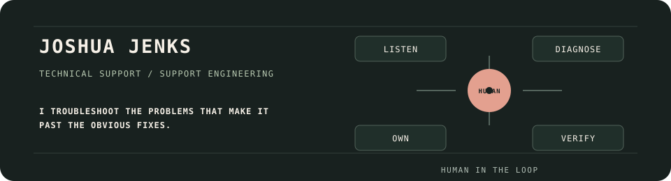

# Joshua Jenks

  

## Technical project manager · production support · developer tooling

I’m a Michigan-based technical project manager and former web developer with a production-support background across managed WordPress, CMS delivery, web operations, troubleshooting, and client-facing technical coordination.

I’m currently building practical tools and learning systems around Kubernetes, Elixir, developer tooling, and practical automation, with a focus on making complex systems easier to understand, troubleshoot, and operate.

I use AI-assisted engineering as part of a deliberate workflow: define the problem, set boundaries, review architecture, validate behavior, and document what changes.

[LinkedIn](https://www.linkedin.com/in/joshuadavidjenks/) · [GitHub](https://github.com/jenksed) · [Detailed project notes](PROJECT_NOTES.md)

## Current focus

- Production and product support
- Platform operations, troubleshooting, and safe changes
- Developer tooling and practical automation
- Kubernetes, Elixir/OTP, Go, and local-first systems

## Selected work

| Project | What it demonstrates | Status |
| --- | --- | --- |
| [Clusterwise](https://github.com/jenksed/clusterwise) | Kubernetes learning systems, operational reasoning, technical writing, and validation | Learning project |
| [macadmin](https://github.com/jenksed/macadmin) | Support automation, shell tooling, testing, and operational safety | Public utility collection |
| [oc-elixir-scout](https://github.com/jenksed/oc-elixir-scout) | Read-only developer tooling, Bash, Elixir/OTP learning, and safe-change thinking | Early tooling project |
| [RoleForge](https://github.com/jenksed/roleforge) | SwiftUI, local-first application design, persistence, and QA planning | In progress |
| [supportlab-relay](https://github.com/jenksed/supportlab-relay) | Go, WebSockets, PTY integration, and local system boundaries | Prototype |

The project notes document the evidence, limitations, and maturity of each project.

## Production background

My earlier work includes more than ten years around web production, support, client delivery, troubleshooting, and production operations. I’ve supported managed WordPress and CMS environments, PHP and MySQL applications, Linux-hosted systems, DNS and SSL/TLS, caching and performance, backups and recovery, APIs, migrations, releases, escalations, and technical documentation.

At Liquid Web, Fusionary, Nolte, and Crown Bioscience, I worked with developers, vendors, clients, marketing, IT, and internal teams to diagnose problems, coordinate fixes, validate outcomes, and communicate technical impact clearly.

## Roles I’m interested in

Technical Support Engineer · Technical Product Support Engineer · Application Support Engineer · Platform Support Engineer · Implementation Specialist or Engineer · Customer Success Engineer · Technical Account Manager · Developer Support or developer-tooling roles · adjacent junior-to-mid-level platform and operations roles

## Links and contact

- [GitHub](https://github.com/jenksed)
- [LinkedIn](https://www.linkedin.com/in/joshuadavidjenks/)
- Contact: The best way to reach me is through LinkedIn or GitHub.
